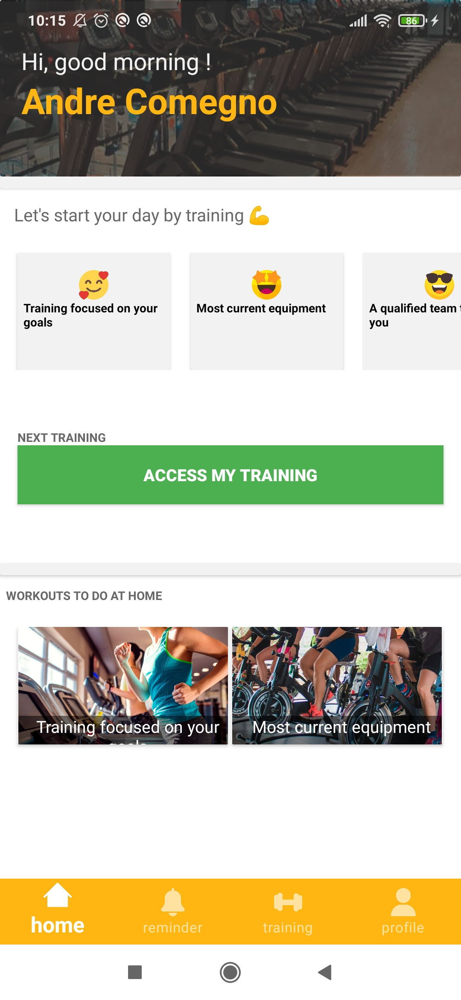
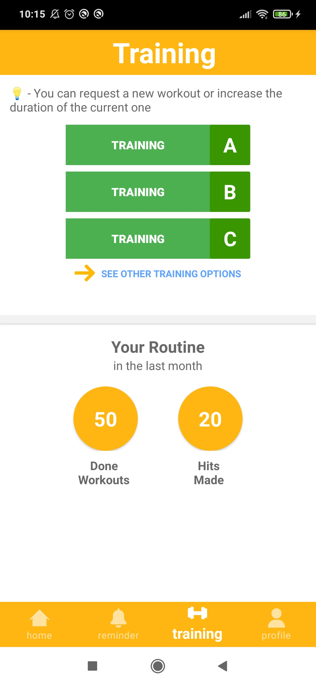
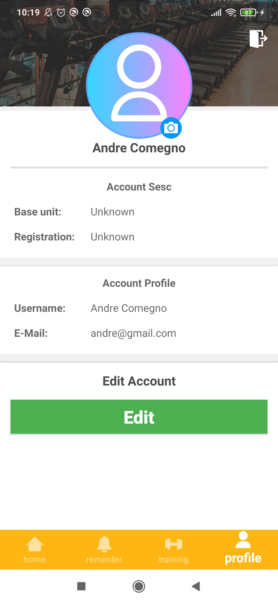

  <a href="https://opensource.org/licenses/MIT">
       
                                                                                   
  </a>

 
# Introdução
O aplicativo SESC GMF foi desenvolvido como um proposta de venda para a instituição privada Serviço Social do Comércio, o aplicativo foi desenvolvido para a necessidade de atualizar e agilizar as aulas de Ginástica Multifuncional (GMF). O aplicativo SESC GMF foi desenvolvido na linguagem Kotlin com o banco de dados Firebase.
Infelizmente não foi aceito por parte do SESC a dar andamento e com isso algumas das funções não estão finalizadas.

## Screenshots

 
    
        
    

 
### 👾 Linguagens e Ferramentas

 

#

 
